# 4. Auto Scaling — Load Balancing & Elasticity

## Architecture

```
                      Internet
                          |
                          v
                 Application Load Balancer (web-alb)
                 ┌──────────────────────────────┐
                 │   Listener: HTTP :80          │
                 │   Target Group: web-tg         │
                 └──────────┬───────────────────┘
                            |
                    ┌───────┴───────┐
                    v               v
            ┌──────────┐     ┌──────────┐
            │ EC2 (AZ1) │     │ EC2 (AZ2) │
            │ t2.micro  │     │ t2.micro  │
            │ index.html│     │ index.html│
            └──────────┘     └──────────┘
                    ^               ^
                    |               |
              ┌─────┴───────────────┴─────┐
              │    Auto Scaling Group     │
              │    Desired: 2  Min: 2     │
              │    Max: 5                 │
              │    Scaling: CPU > 50%     │
              └───────────────────────────┘
```

---

## Theory

### 1. Security Groups — Instance-Level Firewall

Security groups act as virtual firewalls for EC2 instances. They control inbound and outbound traffic at the instance level.

| Feature | Description |
|---------|-------------|
| **Stateful** | If you allow inbound traffic, the response is automatically allowed outbound |
| **Allow-only** | You write allow rules; everything else is denied by default |
| **SG chaining** | One SG can reference another SG as a source — no IPs needed |

**Key pattern:** The ALB's SG allows HTTP from the internet (`0.0.0.0/0`). The web servers' SG allows HTTP only from the ALB's SG. This means traffic flows: Internet → ALB → EC2, and EC2 instances are never directly exposed.

---

### 2. Launch Template

A launch template is the blueprint for EC2 instances in an Auto Scaling Group. It defines:

| Component | What It Specifies |
|-----------|-------------------|
| **AMI** | The OS image (Amazon Linux 2/2023) |
| **Instance type** | t2.micro (free tier) |
| **Key pair** | SSH key for access |
| **Security groups** | Firewall rules for the instance |
| **User data** | Script that runs at first boot |

**User data** is a startup script that runs as root on first launch. It's used to bootstrap the application — install packages, write files, start services.

---

### 3. Auto Scaling Group (ASG)

An ASG maintains a desired count of EC2 instances across multiple Availability Zones.

| Concept | Meaning |
|---------|---------|
| **Desired capacity** | How many instances should be running |
| **Minimum capacity** | Lower bound — ASG never goes below this |
| **Maximum capacity** | Upper bound — ASG never goes above this |
| **Availability Zones** | Spread instances across AZs for fault tolerance |
| **Health checks** | ASG replaces unhealthy instances automatically |

---

### 4. Application Load Balancer (ALB)

An ALB distributes incoming HTTP/S traffic across multiple targets (EC2 instances, IPs, Lambda).

| Feature | Purpose |
|---------|---------|
| **Internet-facing** | Single public DNS name for all traffic |
| **Target group** | Logical grouping of targets (EC2 instances) |
| **Health checks** | Periodically pings instances; unhealthy ones are removed |
| **Cross-zone balancing** | Distributes traffic evenly across all AZs |

---

### 5. Scaling Policies

| Policy Type | How It Works |
|-------------|--------------|
| **Target tracking** | Maintains a metric at a target value (e.g., CPU at 50%) |
| **Step scaling** | Adds/removes instances based on alarm breach magnitude |
| **Simple scaling** | Single action when an alarm triggers |

**Target tracking** is the simplest: "Keep average CPU at 50%. Scale up if higher, scale down if lower."

---

## Project — Auto Scaling Web Servers with ALB

### What We Built

| Component | Value |
|-----------|-------|
| ALB Security Group | `alb-sg` — HTTP from anywhere |
| Web Security Group | `web-sg` — HTTP from `alb-sg` only |
| Launch Template | `asg-web-template` — t2.micro, Amazon Linux 2, user data script |
| Auto Scaling Group | `web-asg` — Desired: 2, Min: 2, Max: 5 |
| Target Group | `web-tg` — HTTP:80, health check on `/` |
| Load Balancer | `web-alb` — Internet-facing, HTTP:80 |
| Scaling Policy | Target tracking — CPU at 50% |

---

### Step 1 — Create Security Group for ALB

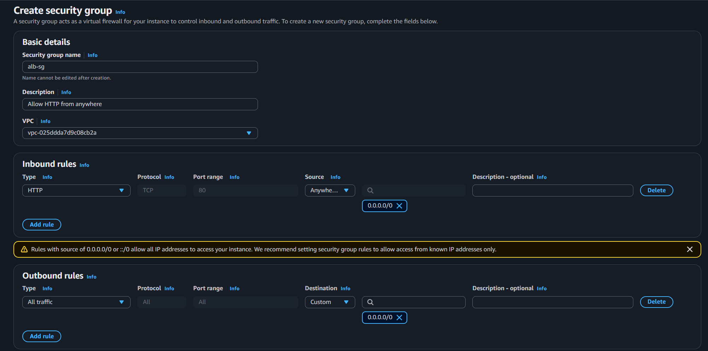

EC2 → Security Groups → Create security group.

- **Name:** `alb-sg`
- **Description:** Allow HTTP from anywhere
- **VPC:** Default VPC

**Inbound rules:**
| Type | Protocol | Port | Source |
|------|----------|------|--------|
| HTTP | TCP | 80 | `0.0.0.0/0` (Anywhere-IPv4) |

**Outbound rules:** Default (all traffic allowed).

This allows anyone on the internet to reach the load balancer on port 80.

---

### Step 2 — Create Security Group for Web Servers

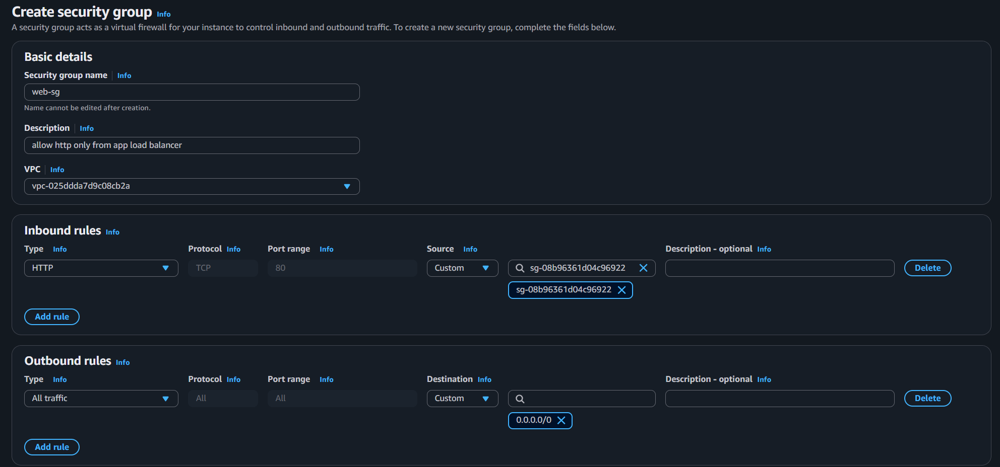

- **Name:** `web-sg`
- **Description:** Allow HTTP only from the ALB
- **VPC:** Default VPC

**Inbound rules:**
| Type | Protocol | Port | Source |
|------|----------|------|--------|
| HTTP | TCP | 80 | `alb-sg` (security group reference) |

**Outbound rules:** Default (all traffic allowed).

The key insight: the web servers have **no direct internet inbound rule**. They only accept traffic that has passed through the ALB. Even if someone knew the EC2 instance's private IP, they couldn't send HTTP traffic directly.

---

### Step 3 — Create Launch Template

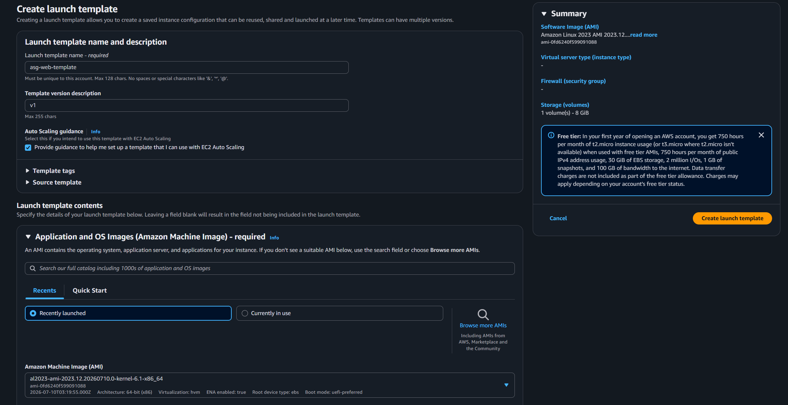

EC2 → Launch Templates → Create launch template.

- **Name:** `asg-web-template`
- **Template version description:** `v1`
- **Auto Scaling guidance:** Checked
- **AMI:** Amazon Linux 2 (HVM), SSD Volume Type (free tier eligible)
- **Instance type:** `t2.micro`
- **Key pair:** Your existing key (e.g., `main`)
- **Subnet:** Don't include in launch template (ASG decides)
- **Security group:** `web-sg`

**User data (startup script):**

```bash
#!/bin/bash
yum update -y
yum install -y python3
echo "Hello from $(curl -s http://169.254.169.254/latest/meta-data/instance-id)" > /home/ec2-user/index.html
cd /home/ec2-user
python3 -m http.server 80 &
```

This script:
1. Updates packages
2. Installs Python 3
3. Creates an HTML page that displays the instance ID (fetched from instance metadata)
4. Starts a simple HTTP server on port 80

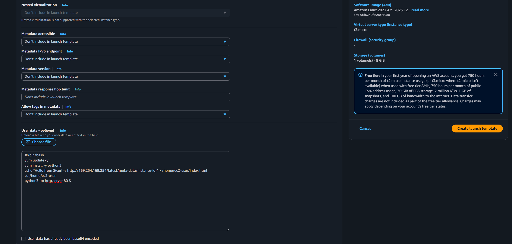

---

### Step 3 — Create Auto Scaling Group (Part 1)

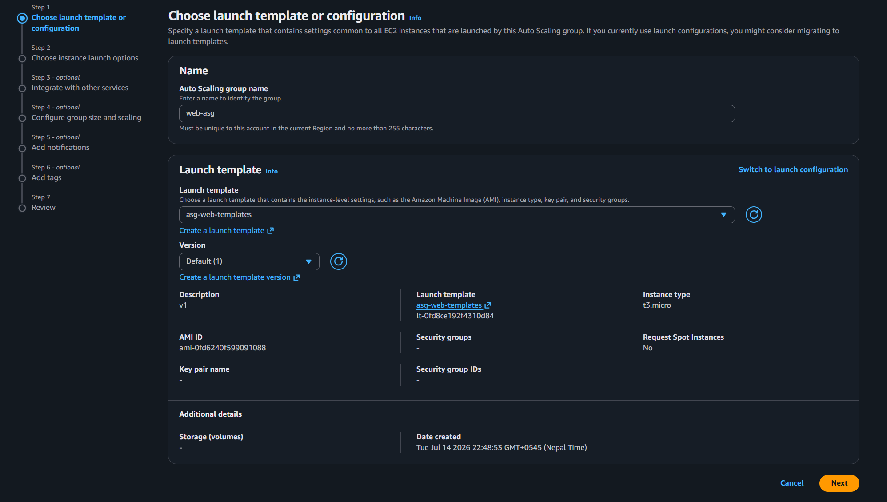

EC2 → Auto Scaling Groups → Create Auto Scaling group.

- **Name:** `web-asg`
- **Launch template:** `asg-web-template`

---

### Step 3 — Configure VPC and Subnets (Part 2)

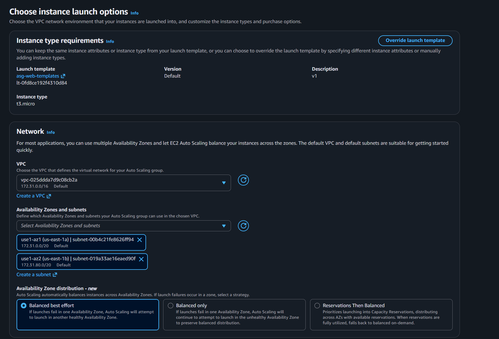

- **VPC:** Default VPC
- **Subnets:** Select at least two subnets in different AZs (e.g., `us-east-1a`, `us-east-1b`)

This gives high availability — if one AZ goes down, instances in the other AZ keep serving traffic.

---

### Step 3 — Configure Group Size (Part 3)

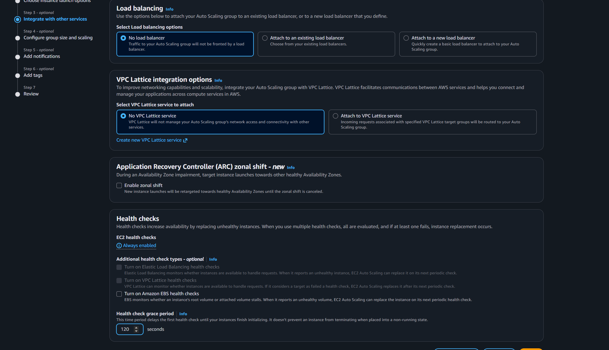

- **Desired capacity:** 2
- **Minimum capacity:** 2
- **Maximum capacity:** 5
- **Scaling policies:** None (add later)

---

### Step 3 — Review and Create (Part 4)

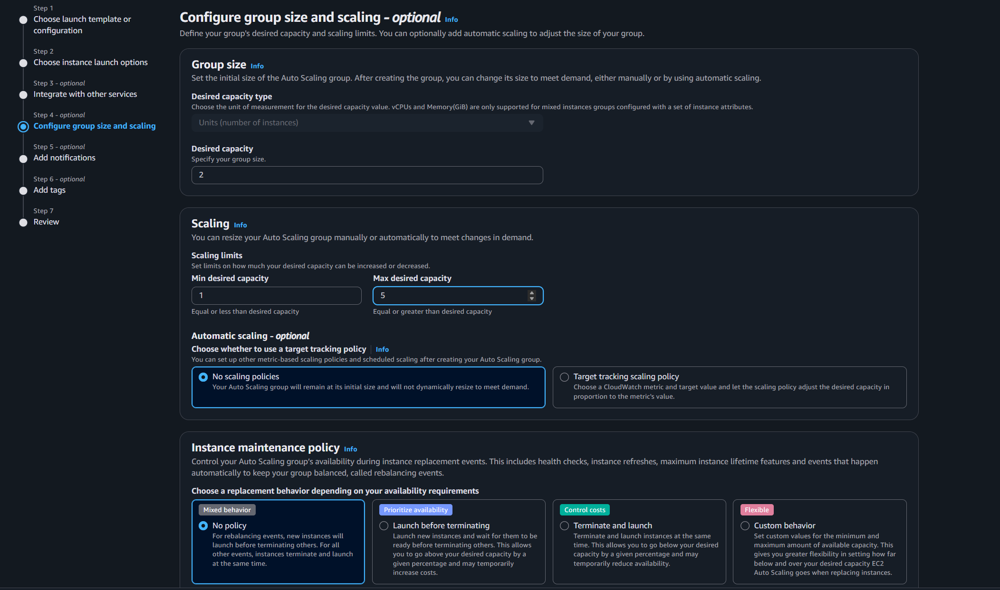

Review the configuration and click **Create Auto Scaling group**.

After creation, check EC2 → Instances — you should see two new instances launching across different AZs.

---

### Step 4 — Create Target Group

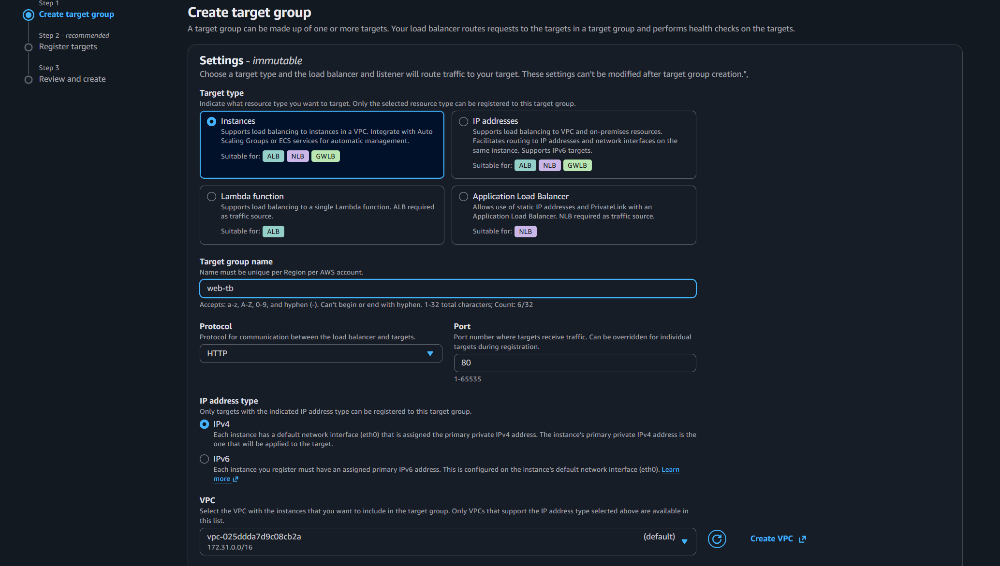

EC2 → Target Groups → Create target group.

- **Target type:** Instances
- **Name:** `web-tg`
- **Protocol:** HTTP, **Port:** 80
- **VPC:** Default VPC
- **Health checks:** Protocol HTTP, Path: `/`

**Do not register instances manually** — the ASG will handle that automatically.

---

### Step 5 — Create Application Load Balancer

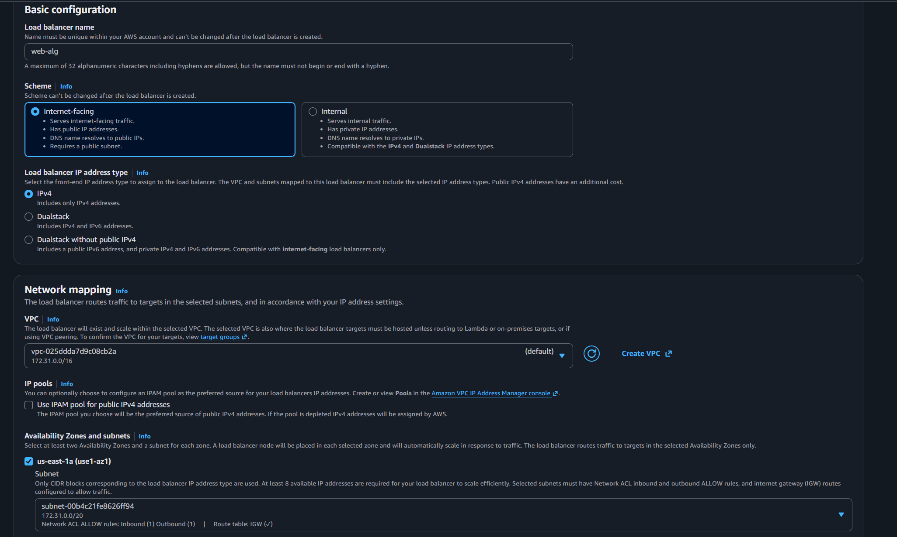

EC2 → Load Balancers → Create Load Balancer → Application Load Balancer.

- **Name:** `web-alb`
- **Scheme:** Internet-facing
- **IP address type:** IPv4
- **VPC:** Default VPC
- **Mappings:** Select at least two public subnets (same ones as ASG)
- **Security group:** `alb-sg`
- **Listener:** HTTP:80
- **Default action:** Forward to `web-tg`

---

### Step 5 — Attach Load Balancer to ASG

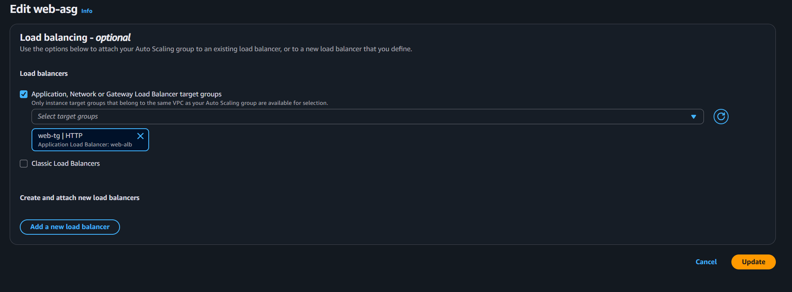

Auto Scaling Groups → `web-asg` → Details → Edit.

- **Load balancing:** Select `web-tg`
- **Enable load balancing health checks:** Checked

Now the ASG automatically registers new instances with the target group, and the ALB health-checks them. Unhealthy instances are replaced.

---

### Step 6 — Add Scaling Policy

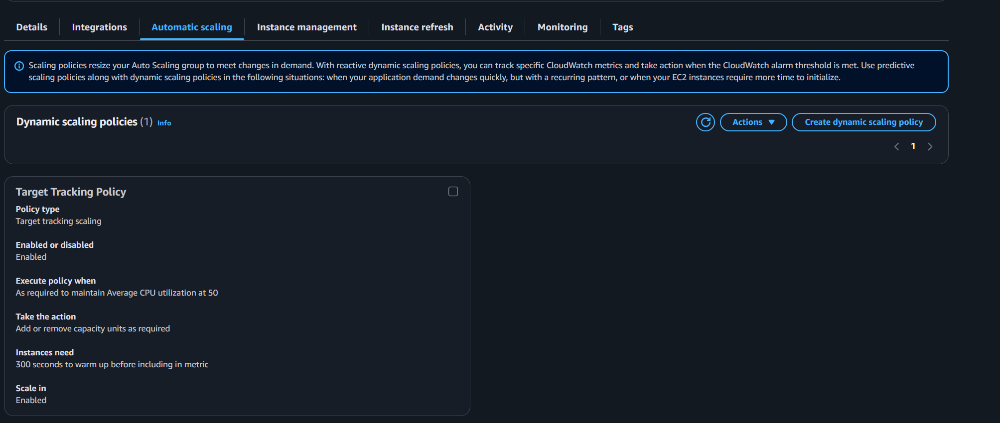

`web-asg` → Automatic scaling → Create dynamic scaling policy.

- **Policy type:** Target tracking scaling
- **Metric:** Average CPU Utilization
- **Target value:** 50 (percent)

This tells AWS: "Keep the average CPU around 50%. If it goes above, add instances; if it drops below, remove them."

---

### Step 7 — Test Your Architecture

1. Go to Load Balancers → `web-alb` → Description tab
2. Copy the **DNS name** (e.g., `web-alb-123456789.us-east-1.elb.amazonaws.com`)
3. Open `http://<DNS-NAME>` in your browser

You should see:
```
Hello from i-0abcd1234efgh5678
```

Refresh the page — the instance ID changes as the ALB distributes requests across instances.

**To test scaling:** Change Desired capacity to 4 → watch two more instances launch → set back to 2.

---

## Key Insights

| Concept | Insight |
|---------|---------|
| **SG chaining** | `web-sg` references `alb-sg` — only traffic through the ALB reaches EC2 |
| **Launch template** | User data script bootstraps the app automatically on first boot |
| **ASG + ALB integration** | ASG auto-registers instances with the target group |
| **Health checks** | ALB pings `/` — unhealthy instances are replaced by the ASG |
| **Target tracking** | "Keep CPU at 50%" — AWS handles the scaling logic |
| **Multi-AZ** | Instances spread across AZs for fault tolerance |

---

## Key Commands

| Command | Purpose |
|---------|---------|
| `curl http://169.254.169.254/latest/meta-data/instance-id` | Get instance ID from within EC2 |
| `python3 -m http.server 80 &` | Start a simple HTTP server on port 80 |
| `yum install -y python3` | Install Python 3 on Amazon Linux 2 |

---

## Clean Up (Important!)

Delete resources in this order to avoid charges:

1. **Auto Scaling Group** (`web-asg`) — terminates the instances
2. **Load Balancer** (`web-alb`) — also delete the target group when asked
3. **Launch Template** (`asg-web-template`)
4. **Security Groups** (`alb-sg` and `web-sg`)
