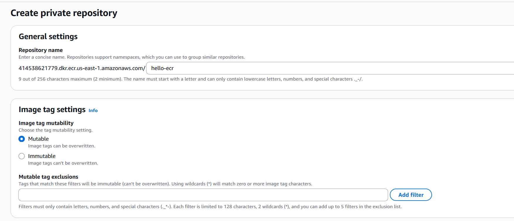
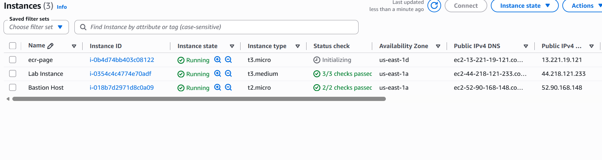

# 07 — ECR (Elastic Container Registry) — Dockerized Static Website

## Architecture

```
        Local Machine (VS Code)                Registry (Docker Hub / ECR)              AWS EC2
   ┌─────────────────────────┐          ┌──────────────────────────────┐        ┌──────────────────┐
   │  code/index.html        │  build   │  hello-ecr:latest            │  pull  │  nginx container  │
   │  code/Dockerfile        │ ────────▶│  (image stored remotely)     │ ──────▶│  listens on :80   │
   │  docker build → tag     │          │                              │        │  port 80 exposed  │
   │  docker push            │          └──────────────────────────────┘        └──────────────────┘
   └─────────────────────────┘                                                     │
                                                                                   ▼
                                                                        Browser  http://<public-ip>
```

The image is built **once** locally, stored in a **remote registry**, then **pulled** and run anywhere — in this project, on a public EC2 instance.

---

## Theory

### 1. Container Registry

A registry is a **centralized store for Docker images**.

| Term | Meaning |
|------|---------|
| **Registry** | Service that stores images (e.g., Docker Hub, ECR) |
| **Repository** | A named collection of images (e.g., `hello-ecr`) |
| **Image** | The immutable snapshot of app + dependencies |
| **Tag** | A label on an image version (e.g., `latest`, `v1.0`) |

**Why use a registry?**
- Images become portable — pull them on any machine
- Enables CI/CD (build → push → deploy)
- Teams share the same exact artifact

### 2. Docker Hub (free public registry)

- Default registry — `docker.io`
- Public repos: **anyone can pull, no login required**
- Pushing (and private repos) require authentication: `docker login`

### 3. nginx:alpine base image

- **Official** image, maintained by the nginx project
- **alpine** variant = ~5 MB base, minimal attack surface
- Serves static files from `/usr/share/nginx/html/`

### 4. Docker build workflow

```
Dockerfile → docker build → docker tag → docker push
                                         └──────────▶ stored in registry
```

- `docker build` reads the `Dockerfile` and produces an image
- The `COPY` instruction layers our `index.html` on top of nginx
- `docker tag` assigns the remote name/version (`user/hello-ecr:latest`)
- `docker push` uploads the layers to the registry

### 5. Amazon ECR (the real-AWS registry)

| Feature | Docker Hub | Amazon ECR |
|---------|-----------|------------|
| **Registry URI** | `docker.io/username/repo` | `<account-id>.dkr.ecr.<region>.amazonaws.com/repo` |
| **Auth** | `docker login` with username/password | `aws ecr get-login-password` + IAM |
| **Visibility** | Public or private | Private by default (IAM-gated) |
| **Push/pull** | `docker push/pull` | Same `docker` commands |

**Key insight:** the Docker commands (`build`, `tag`, `push`, `pull`, `run`) are **identical** for Docker Hub and ECR. Only the registry URI and login method change.

---

## Project — Deploy a Static Site via Container Registry

### Phase 1 — Local files

Files in the `code/` folder:

**`code/index.html`**
```html
<!DOCTYPE html>
<html>
<head><title>Hello ECR</title></head>
<body>
    <h1>Hello from my own Docker image on ECR!</h1>
    <p>Deployed on EC2.</p>
</body>
</html>
```

**`code/Dockerfile`**
```dockerfile
FROM nginx:alpine
COPY index.html /usr/share/nginx/html/index.html
```

A **minimal two-line image**: take official nginx, swap in our page.

---

### Phase 2 — Push image to Docker Hub



1. Create a free account at `hub.docker.com`
2. Create a repository named **`hello-ecr`**, visibility **Public**

Then from the project folder:

```powershell
# 1. Login to Docker Hub
docker login -u your-dockerhub-username

# 2. Build the image (from the folder containing the Dockerfile)
docker build -t your-dockerhub-username/hello-ecr:latest .

# 3. Push to the registry
docker push your-dockerhub-username/hello-ecr:latest
```

The image now lives in a remote registry, pullable from anywhere.

---

### Phase 3 — Launch a public EC2 instance



| Setting | Value |
|---------|-------|
| **AMI** | Amazon Linux 2023 |
| **Type** | t3.micro |
| **Key pair** | `s3_kp.pem` |
| **Network** | Default VPC, public subnet, public IP enabled |
| **Security group** | `ecr-demo-sg` |
| **User data** | None |

**Security Group `ecr-demo-sg`:**

| Type | Protocol | Port | Source |
|------|----------|------|--------|
| SSH | TCP | 22 | Your IP (`/32`) |
| HTTP | TCP | 80 | `0.0.0.0/0` |

Note the **Public IPv4 address** (e.g., `54.12.34.56`).

---

### Phase 4 — Deploy the container on EC2

SSH in:

```bash
ssh -i "C:\Users\Aagaman\Downloads\s3_kp.pem" ec2-user@<public-ip>
```

Install Docker (Amazon Linux 2023 uses `dnf`):

```bash
sudo dnf update -y
sudo dnf install -y docker
sudo systemctl enable --now docker
sudo usermod -aG docker ec2-user
newgrp docker   # or log out and back in
```

Pull and run:

```bash
# Public repo → no login needed to pull
docker pull your-dockerhub-username/hello-ecr:latest

# Run the container, mapping host port 80 → container port 80
docker run -d -p 80:80 --name my-hello your-dockerhub-username/hello-ecr:latest
```

---

### Phase 5 — Test

Open `http://<public-ip>` in a browser → you should see **"Hello from my own Docker image on ECR!"**.

---

## Mapping to Amazon ECR (Real Account)

Same workflow, only two differences:

| Step | Docker Hub (this project) | Amazon ECR (real account) |
|------|---------------------------|---------------------------|
| **Registry URI** | `docker.io/username/hello-ecr` | `<account-id>.dkr.ecr.<region>.amazonaws.com/hello-ecr` |
| **Authentication** | `docker login -u username` | `aws ecr get-login-password \| docker login --username AWS --password-stdin <registry-uri>` |

```powershell
# Login to ECR
aws ecr get-login-password | docker login --username AWS --password-stdin <account-id>.dkr.ecr.<region>.amazonaws.com

# Tag to ECR URI
docker tag hello-ecr:latest <account-id>.dkr.ecr.<region>.amazonaws.com/hello-ecr:latest

# Push / pull / run — exactly the same commands
docker push <account-id>.dkr.ecr.<region>.amazonaws.com/hello-ecr:latest
docker run -d -p 80:80 --name my-hello <account-id>.dkr.ecr.<region>.amazonaws.com/hello-ecr:latest
```

> On EC2/ECS/EKS, IAM roles replace static credentials — the instance gets a role that grants pull access, no login stored on the box.

---

## Key Insights

| Concept | Insight |
|---------|---------|
| **Build once, run anywhere** | The image is the single deployable artifact, independent of the host |
| **Public vs private** | Public = free pulls (no auth); private = auth via password (Hub) or IAM (ECR) |
| **ECR = same Docker commands** | Only registry URI and login differ from Docker Hub |
| **`latest` tag** | Convenient but mutable — pin versioned tags (`v1.0`) for production |
| **Alpine base** | Tiny, official base images reduce size and attack surface |
| **Host → container ports** | `-p 80:80` maps host port 80 to nginx's internal 80 |
| **IAM role on EC2** | Production: instance role grants ECR pull — never store credentials on the box |

---

## Key Commands

| Command | Purpose |
|---------|---------|
| `docker build -t user/hello-ecr:latest .` | Build image from Dockerfile |
| `docker tag img user/hello-ecr:latest` | Tag image for a registry |
| `docker login -u username` | Authenticate to Docker Hub |
| `docker push user/hello-ecr:latest` | Upload image to registry |
| `docker pull user/hello-ecr:latest` | Download image (public = no auth) |
| `docker run -d -p 80:80 --name my-hello user/hello-ecr:latest` | Run container detached on port 80 |
| `docker ps` | List running containers |
| `docker logs my-hello` | View container logs |
| `aws ecr get-login-password \| docker login --username AWS --password-stdin <uri>` | Authenticate to ECR |
| `docker image ls` | List local images |

---

## Mistakes & Fixes Log

| Mistake | Symptom | Fix |
|---------|---------|-----|
| Pushing to a non-existent repo | `denied: requested access to the resource is denied` | Create the repository in Docker Hub first |
| Not logged in before push | `denied: requested access...` / `unauthorized` | `docker login` before `docker push` |
| Wrong image name/tag | Push goes to wrong repo | Tag with full `username/repo:tag` before pushing |
| Pulling a private repo without auth | `pull access denied` | Make repo public, or `docker login` first |
| Port 80 already in use on EC2 | `docker run` fails with port conflict | `docker rm -f my-hello` then re-run |
| SSH key permissions too open (Windows) | SSH refuses the key | Use the `.pem` path correctly in `-i` |
| HTTP timeout in browser | Security group missing port 80 | Add inbound HTTP `0.0.0.0/0` to `ecr-demo-sg` |

---

## Clean Up

1. **EC2** — terminate the instance (stops compute charges)
2. **Docker** — on the instance: `docker rm -f my-hello && docker rmi user/hello-ecr:latest`
3. **Docker Hub** — optional: delete the `hello-ecr` repository (Image Hub → repo → Settings → Delete)
4. **ECR (real account)** — `aws ecr delete-repository --repository-name hello-ecr --force`
