# 0. VPC — Virtual Private Cloud (Production Network)

## Architecture

```
                     Internet
                         |
                         v
                  Internet Gateway (Production-IGW)
                         |
                         |  VPC (10.0.0.0/16)
              +----------+----------+
              |                     |
         Public Subnet         Private Subnet
         (10.0.1.0/24)        (10.0.2.0/24)
              |                     |
         Route Table:           Route Table:
         0.0.0.0/0 -> IGW       0.0.0.0/0 -> NAT Gateway
              |                     |
         +----+----+           +----+----+
         |         |           |         |
    Bastion Host   NAT     Application   Database
    (t2.micro)   Gateway   Server        (RDS / on EC2)
    Public IP    Elastic   (t2.micro)
                 IP        No Public IP
```

---

## Theory

### 1. CIDR Blocks (Classless Inter-Domain Routing)

A CIDR block defines an IP address range using a prefix length.

| Notation | Network Bits | Host Bits | Total IPs | Usable IPs (AWS) |
|----------|-------------|-----------|-----------|------------------|
| 10.0.0.0/16 | 16 | 16 | 65,536 | 65,531 |
| 10.0.1.0/24 | 24 | 8 | 256 | 251 |
| 10.0.2.0/24 | 24 | 8 | 256 | 251 |
| 10.0.0.0/28 | 28 | 4 | 16 | 11 |

**Key insight:** `/16` is your VPC, `/24` is a subnet. AWS reserves 5 IPs per subnet (first 4 + last 1), so usable = total - 5.

**Private IP ranges (RFC 1918):** `10.0.0.0/8`, `172.16.0.0/12`, `192.168.0.0/16` — never conflict with the public internet.

---

### 2. VPC (Virtual Private Cloud)

- A logically isolated, private network inside AWS.
- You choose its size (CIDR block). Everything inside stays private unless you explicitly open it.
- **Default VPC** — AWS gives you one; all subnets are public by default. Good for testing, bad for production.
- **Custom VPC** — You decide subnets, routing, gateways, security. Full control.

---

### 3. Subnets — Public vs Private

- Subnets split the VPC into smaller CIDR blocks (e.g., `10.0.1.0/24`) and live in a single Availability Zone.
- **A subnet itself is always private** — it only contains private IPs.
- **Public subnet** = has a route to an Internet Gateway (IGW) in its route table.
- **Private subnet** = no route to IGW; remains hidden from the internet.
- A **public IP** is a 1:1 mapping managed by the IGW — it is NOT part of the subnet's CIDR.

| Property | Public Subnet | Private Subnet |
|----------|--------------|----------------|
| Route to IGW | Yes | No |
| Route to NAT | No (or optional) | Yes (for outbound) |
| Instances get public IP | Usually yes | Never |
| Direct internet access | Yes | No (outbound only via NAT) |

---

### 4. Internet Gateway (IGW)

- The front door of the VPC.
- Performs **1:1 NAT** — translates a public IP to a private IP and vice versa.
- Attached to the VPC (not to a subnet). Only works for subnets with a route to it.
- Without it, **zero internet traffic** enters or leaves the VPC — even if instances have public IPs.

---

### 5. Route Tables

- Every subnet must be associated with a route table.
- The **local route** (`10.0.0.0/16 -> local`) is always present — keeps VPC-internal traffic inside.
- **Default route** (`0.0.0.0/0`) defines how traffic to the internet is handled:
  - Point to **IGW** = subnet becomes public.
  - Point to **NAT Gateway** = private subnet gets outbound-only internet.
- Route tables are what actually define "public" vs "private" — not the subnet itself.

---

### 6. NAT Gateway

- Allows outbound-only internet access for instances in **private subnets**.
- Lives in a **public subnet** (needs its own route to IGW).
- Has an **Elastic IP** (static public IP).
- Traffic from private instances appears to come from the NAT's Elastic IP.
- **Inbound connections from the internet are impossible** — NAT is outbound-only.

| Without NAT | With NAT |
|-------------|----------|
| Private instances cannot reach the internet | Private instances can download updates, call APIs |
| No outbound connectivity at all | Outbound only — no inbound exposure |
| Cannot install packages, access S3, etc. | Can access all AWS services and the internet |

---

### 7. Security Groups (SG)

- **Stateful firewall** at the instance level.
- **Inbound rules** — what traffic can reach the instance.
- **Outbound rules** — what traffic can leave the instance.
- You only write **allow** rules; everything else is denied by default.
- **Stateful** — if you allow an inbound request, the response is automatically allowed.
- SGs can reference other SGs as sources — e.g., `App-SG` allows SSH from `Bastion-SG`. This works via private IPs and auto-updates when instances change.

---

### 8. Network ACLs (NACL)

- **Stateless firewall** at the subnet level (extra moat around the subnet).
- Supports both **allow** and **deny** rules, evaluated in order (lowest rule number first).
- **Stateless** — inbound and outbound rules are independent; responses must be explicitly allowed.
- Default NACL allows all traffic. Custom NACLs deny all unless you add rules.
- In practice, security groups are usually sufficient; NACLs are rarely needed.

| Feature | Security Group | Network ACL |
|---------|---------------|-------------|
| Level | Instance | Subnet |
| Stateful | Yes | No |
| Rules | Allow only | Allow + Deny |
| Rule evaluation | All rules evaluated | Lowest number first |
| Default | Deny all inbound, allow all outbound | Allow all (default NACL) |

---

## Project — Build a Production VPC

### What We Built

| Component | Value |
|-----------|-------|
| VPC CIDR | `10.0.0.0/16` |
| Public Subnet | `10.0.1.0/24` (us-east-1a) |
| Private Subnet | `10.0.2.0/24` (us-east-1a) |
| Internet Gateway | `Production-IGW` |
| Public Route Table | `0.0.0.0/0` -> IGW |
| Private Route Table | `0.0.0.0/0` -> NAT Gateway |
| NAT Gateway | `Production-NAT` (in public subnet) |
| Bastion Host | Public subnet, `Bastion-SG` (SSH from My IP) |
| App Server | Private subnet, `App-SG` (SSH from Bastion-SG) |

---

### Step 1 — Create the VPC

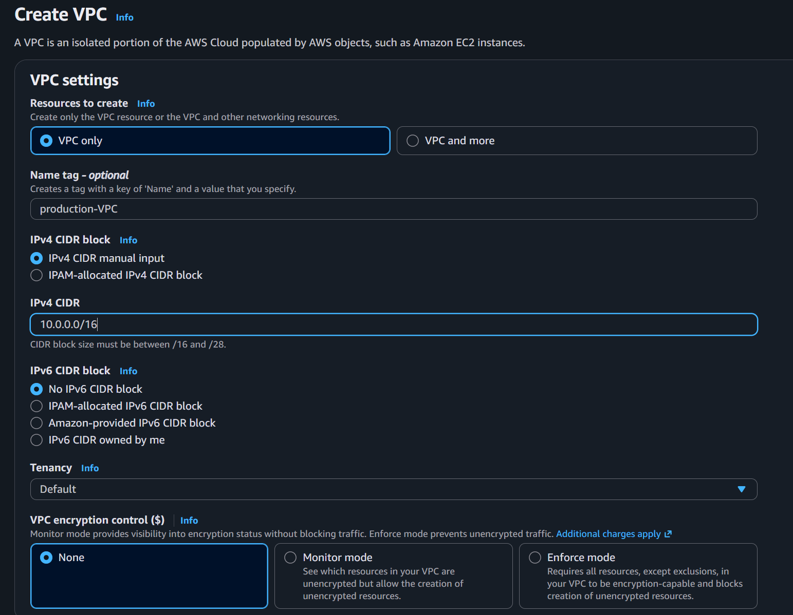

Go to VPC Dashboard -> Your VPCs -> Create VPC.

- **Name tag:** `Production-VPC`
- **IPv4 CIDR:** `10.0.0.0/16`
- **Tenancy:** Default

This gives us 65,536 IP addresses to divide into subnets.

---

### Step 2 — Create Public Subnet

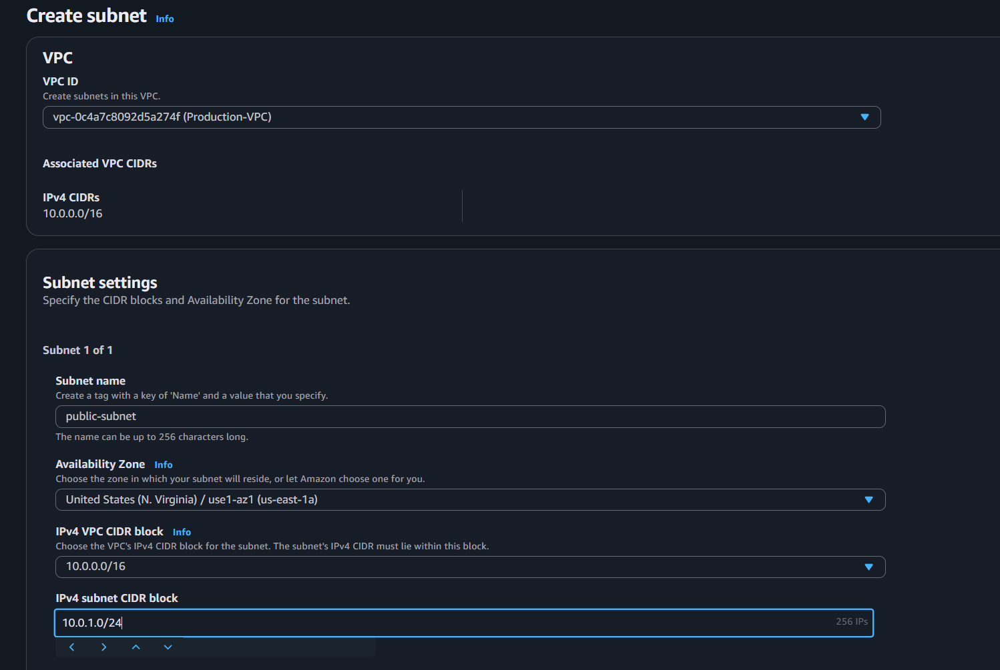

Subnets -> Create subnet.

- **VPC:** Production-VPC
- **Name:** `Public-Subnet`
- **AZ:** `us-east-1a`
- **CIDR:** `10.0.1.0/24`

256 IPs (251 usable after AWS reserves 5).

---

### Step 3 — Create Private Subnet

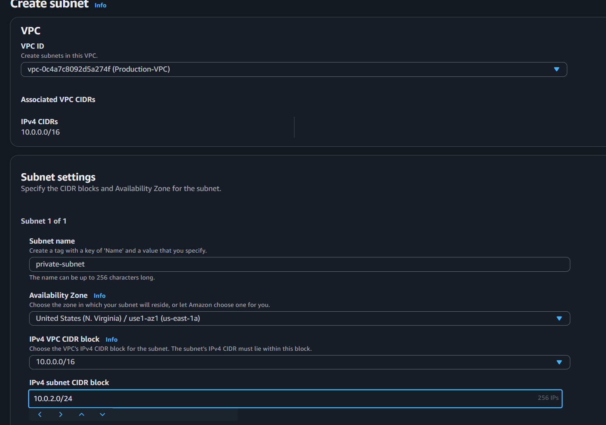

- **VPC:** Production-VPC
- **Name:** `Private-Subnet`
- **AZ:** `us-east-1a`
- **CIDR:** `10.0.2.0/24`

Same AZ for simplicity. In production, you'd spread across multiple AZs for high availability.

Both subnets are private by default at this point — no gateway attached yet.

---

### Step 4 — Create and Attach Internet Gateway

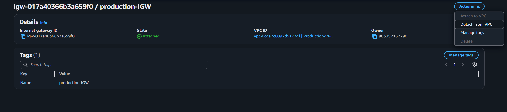

Internet Gateways -> Create internet gateway.

- **Name:** `Production-IGW`

Then: **Actions -> Attach to VPC** -> select `Production-VPC`.

Now the VPC has a door to the internet. Next we need route tables to use it.

---

### Step 5 — Create Public Route Table

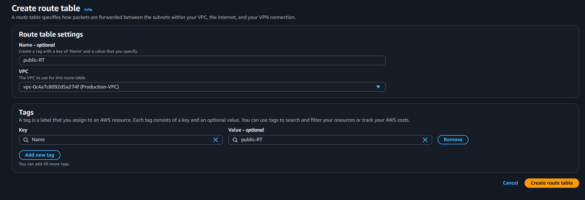

Route Tables -> Create route table.

- **Name:** `Public-RT`
- **VPC:** Production-VPC

---

### Step 6 — Add Route to Internet Gateway

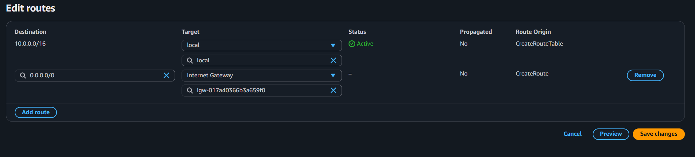

Select `Public-RT` -> Routes tab -> Edit routes -> Add route:

- **Destination:** `0.0.0.0/0`
- **Target:** Internet Gateway -> `Production-IGW`

This single route makes any subnet associated with this route table "public."

---

### Step 7 — Associate Public Subnet

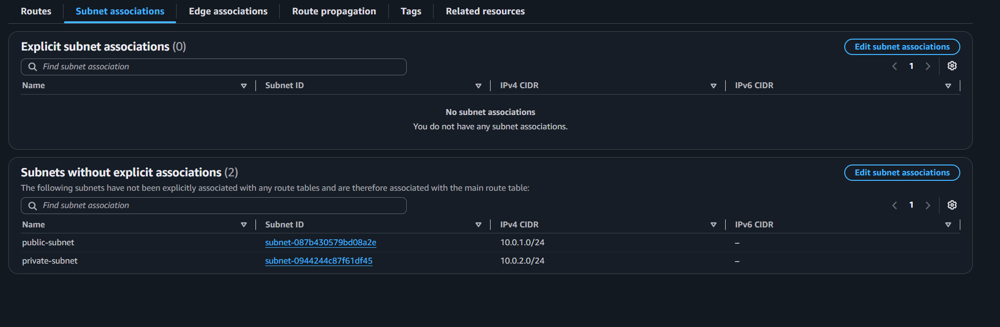

Go to **Subnet associations** tab -> Edit subnet associations.

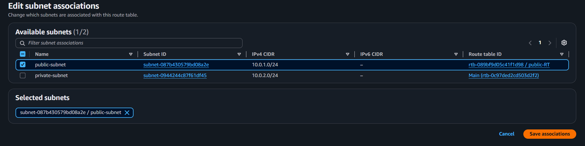

Select `Public-Subnet` and save.

Now `Public-Subnet` has:
- Local route (`10.0.0.0/16 -> local`) for VPC-internal traffic
- Internet route (`0.0.0.0/0 -> IGW`) for public internet traffic

---

### Step 8 — Create Private Route Table (and Attach Private Subnet)

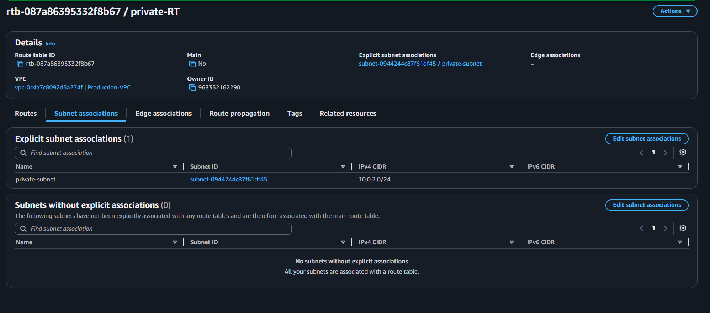

Create another route table:

- **Name:** `Private-RT`
- **VPC:** Production-VPC

Associate it with `Private-Subnet` (same process as above — Subnet associations -> Edit -> select Private-Subnet -> Save).

By default it only has the local route — no internet access at all.

---

### Step 9 — Create Elastic IP for NAT Gateway

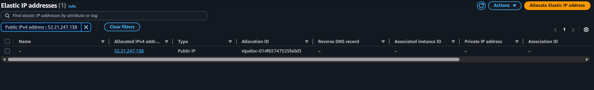

Elastic IPs -> Allocate Elastic IP address -> Allocate.

This gives us a static public IP that won't change when the NAT Gateway restarts.

---

### Step 10 — Create NAT Gateway

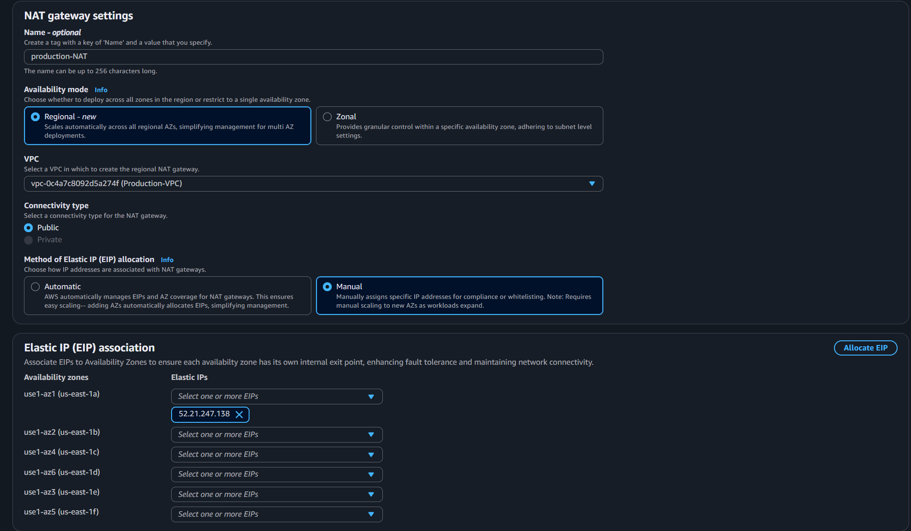

NAT Gateways -> Create NAT gateway.

- **Name:** `Production-NAT`
- **Subnet:** `Public-Subnet` (critical — NAT must live in a public subnet)
- **Elastic IP:** Select the one just allocated

Wait a minute for it to become `Available`.

---

### Step 11 — Add NAT Route to Private Route Table

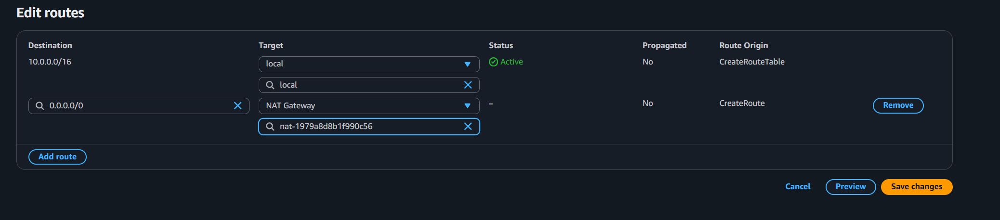

Select `Private-RT` -> Routes -> Edit routes -> Add route:

- **Destination:** `0.0.0.0/0`
- **Target:** NAT Gateway -> `Production-NAT`

Now instances in the private subnet can initiate outbound connections (updates, API calls) but cannot be reached from the internet.

---

### Step 12 — Create Bastion Security Group

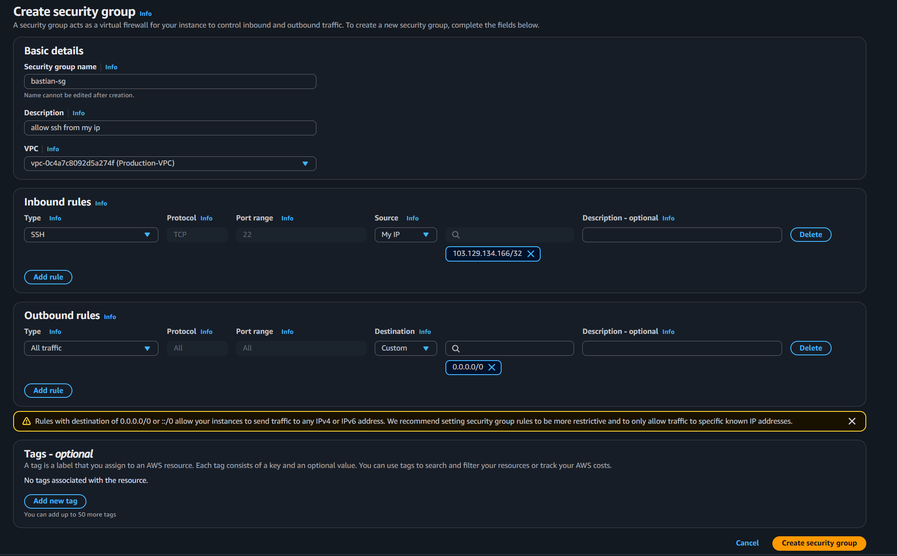

Security Groups -> Create security group.

- **Name:** `Bastion-SG`
- **Description:** Allow SSH only from my IP
- **VPC:** Production-VPC

**Inbound rules:**
| Type | Protocol | Port | Source |
|------|----------|------|--------|
| SSH | TCP | 22 | My IP (your home IPv4, e.g., `103.129.134.166/32`) |

**Outbound rules:** Default (all traffic allowed).

---

### Step 13 — Create App Security Group (References Bastion SG)

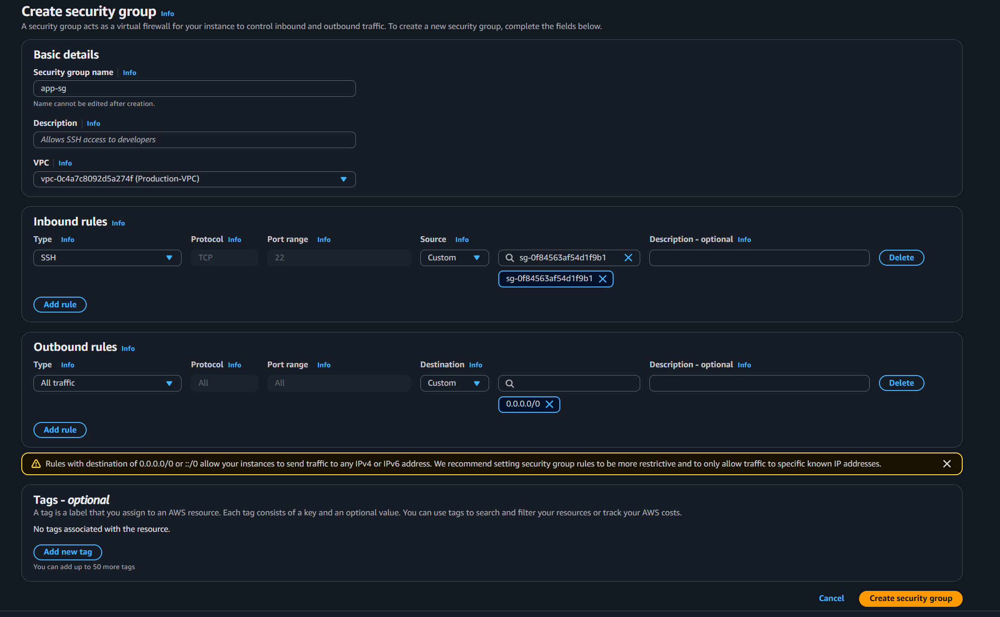

- **Name:** `App-SG`
- **VPC:** Production-VPC

**Inbound rules:**
| Type | Protocol | Port | Source |
|------|----------|------|--------|
| SSH | TCP | 22 | `Bastion-SG` (security group ID, not an IP) |

**Outbound rules:** Default (all traffic allowed).

This is the key security pattern:
- Only the bastion host can SSH to the app server.
- The app server has **no public IP** and **no direct internet inbound rules**.
- Even if you knew the app server's private IP, you couldn't SSH unless you were on the bastion.

---

### Step 14 — Launch Bastion Host (Public Subnet)

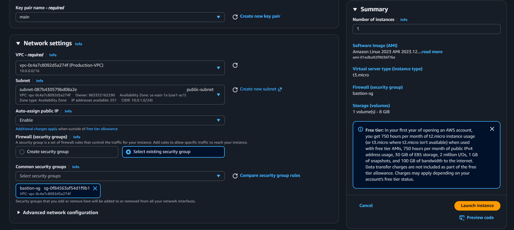

EC2 -> Instances -> Launch instance.

- **Name:** `Bastion`
- **AMI:** Amazon Linux 2023
- **Type:** `t2.micro`
- **Key pair:** Your existing key (or create new)
- **Network settings:**
  - VPC: `Production-VPC`
  - Subnet: `Public-Subnet`
  - Auto-assign public IP: **Enable**
  - Security group: `Bastion-SG`

The bastion gets a public IP and is reachable from your home IP only.

---

### Step 15 — Launch App Server (Private Subnet)

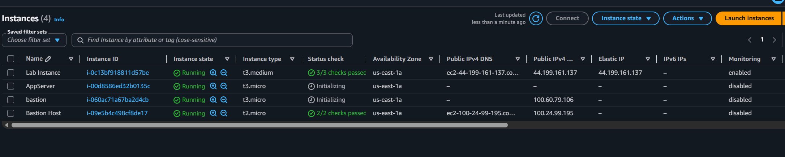

- **Name:** `AppServer`
- **AMI:** Amazon Linux 2023
- **Type:** `t2.micro`
- **Key pair:** Same key as bastion
- **Network settings:**
  - VPC: `Production-VPC`
  - Subnet: `Private-Subnet`
  - Auto-assign public IP: **Disable** (important!)
  - Security group: `App-SG`

No public IP. Only reachable from the bastion host via private IP.

---

### Step 16 — SSH into Bastion and Connect to App Server

From your local machine:

```bash
ssh -i main.pem ec2-user@<BASTION-PUBLIC-IP>
```

Copy your key to the bastion:

```bash
scp -i main.pem main.pem ec2-user@<BASTION-PUBLIC-IP>:~/
```

SSH from bastion to app server:

```bash
chmod 400 main.pem
ssh -i main.pem ec2-user@10.0.2.96
```

You are now inside the private instance!

---

### Verification — Testing the Network Behavior

**1. Private instance can reach the internet (via NAT)**

From inside the app server:

```bash
curl google.com
# ...returns HTML... NAT Gateway is working!
```

**2. Private instance has no public IP**

```bash
curl http://169.254.169.254/latest/meta-data/public-ipv4
# ...returns nothing (404 or empty)...
```

No public IP = no direct internet inbound.

**3. Private instance cannot be SSHed from outside**

From your local machine, there is no route to `10.0.2.96` — it's a private IP. Even AWS's own internet cannot reach it because the IGW only maps public IPs, and there is none for this instance.

**4. Inspect route tables**

In the console, go to VPC -> Route Tables. Select `Public-RT` and `Private-RT` to compare:

| Public-RT | Private-RT |
|-----------|------------|
| `10.0.0.0/16 -> local` | `10.0.0.0/16 -> local` |
| `0.0.0.0/0 -> igw-xxx` | `0.0.0.0/0 -> nat-xxx` |

**5. Inspect security group rules**

- `Bastion-SG`: Inbound SSH from your home IP only.
- `App-SG`: Inbound SSH from `Bastion-SG` (security group reference, not IP).

---

### Troubleshooting — SSH Connection Timed Out

During the build, the initial SSH from bastion to app server timed out:

```
ssh: connect to host 10.0.2.96 port 22: Connection timed out
```

**Root cause:** The bastion's outbound rule was too restrictive — it only allowed SSH to `103.129.134.166/32` (the home IP). The bastion could not initiate SSH to the private IP `10.0.2.96`.

**Fix:** Changed the outbound rule in `Bastion-SG` to allow all traffic (`0.0.0.0/0`) or at minimum the VPC CIDR (`10.0.0.0/16`).

After the fix:

```
[ec2-user@ip-10-0-1-70 ~]$ ssh -i "main.pem" ec2-user@10.0.2.96
The authenticity of host '10.0.2.96 (10.0.2.96)' can't be established.
ED25519 key fingerprint is SHA256:53X2wEvLAT4N+13viSkalzYj/mZWbgD6RAP+Rs2bbwo.
Are you sure you want to continue connecting (yes/no/[fingerprint])? yes
   ,     #_
   ~\_  ####_        Amazon Linux 2023
  ~~  \_#####\
  ~~     \###|
  ~~       \#/ ___   https://aws.amazon.com/linux/amazon-linux-2023
   ~~       V~' '->
    ~~~         /
      ~~._.   _/
         _/ _/
       _/m/'
[ec2-user@ip-10-0-2-96 ~]$
```

---

## Key Insights

| Concept | Insight |
|---------|---------|
| **Public IP is not in the subnet** | It's a 1:1 NAT label on the IGW, not an address from the subnet CIDR |
| **Route tables define public/private** | Change the route table, change the subnet's nature — no IPs change |
| **SG references beat IP whitelisting** | `App-SG` allows SSH from `Bastion-SG` — auto-adapts when instances are replaced |
| **Security groups are stateful** | Allow inbound SSH, and the response flows out automatically |
| **NAT is outbound-only** | Private instances remain invisible to the internet |
| **AWS networking is explicit allow** | Default is always deny — every rule must be intentional |
| **NAT must live in a public subnet** | It needs its own internet route to forward traffic for private instances |

---

## Key Commands

| Command | Purpose |
|---------|---------|
| `ssh -i main.pem ec2-user@<BASTION-PUBLIC-IP>` | SSH into bastion host |
| `scp -i main.pem main.pem ec2-user@<BASTION-PUBLIC-IP>:~/` | Copy key to bastion |
| `chmod 400 main.pem` | Set correct permissions on key |
| `ssh -i main.pem ec2-user@10.0.2.96` | SSH from bastion to app server (private IP) |
| `curl google.com` | Test outbound internet via NAT |
| `curl http://169.254.169.254/latest/meta-data/public-ipv4` | Check if instance has a public IP |
| `ip route show` | Show routing table on Linux instance |
| `ping -c 3 8.8.8.8` | Test internet connectivity (ICMP) |

---

## Mistakes & Fixes Log

| Mistake | Symptom | Fix |
|---------|---------|-----|
| Bastion SG outbound restricted to home IP | `ssh: connect to host 10.0.2.96 port 22: Connection timed out` | Change outbound to allow all traffic (`0.0.0.0/0`) |
| App instance launched without key | Cannot SSH from bastion | Terminate and relaunch with correct key pair |
| NAT Gateway in private subnet | NAT has no internet route, private instances can't reach internet | NAT must be in a **public subnet** |
| Private instance has public IP assigned | Instance is still shielded by SG, but unnecessary exposure | Disable "Auto-assign public IP" for private subnets |
| Wrong VPC selected for security group | SG not visible when launching instance in the custom VPC | Always match VPC when creating SGs |
| Forgot to associate route table with subnet | Subnet uses default route table (usually the main RT with no IGW route) | Explicitly associate each subnet with its intended route table |

---

## Comparison — Default VPC vs Custom VPC

| Feature | Default VPC | Custom VPC (Production-VPC) |
|---------|-------------|---------------------------|
| Subnets | All public (have IGW route) | You decide public/private |
| Internet Gateway | Already attached | You create and attach |
| Route Tables | Main RT with IGW route | You create separate RTs for public/private |
| Security | Wide open by default | Tightly controlled |
| NAT Gateway | Not present | You add for private subnet outbound |
| Use case | Quick testing | Production workloads |

---

## Final Thoughts

The key mental model: **AWS networking is just real-world networking, virtualized.**

- VPC = your building
- Subnets = floors (public floor has a door to the street, private floor doesn't)
- IGW = front door (1:1 mapping of public address to private apartment)
- Route tables = the building directory (tells traffic which way to go)
- NAT Gateway = a mailbox (you can send letters out, but no one can mail you back)
- Security groups = door locks on each apartment (stateful — once inside, you can move freely)

Everything you learned here (CIDR, routing, NAT, firewalls) applies directly to on-premises networking, just with clickable UI instead of physical cables.
